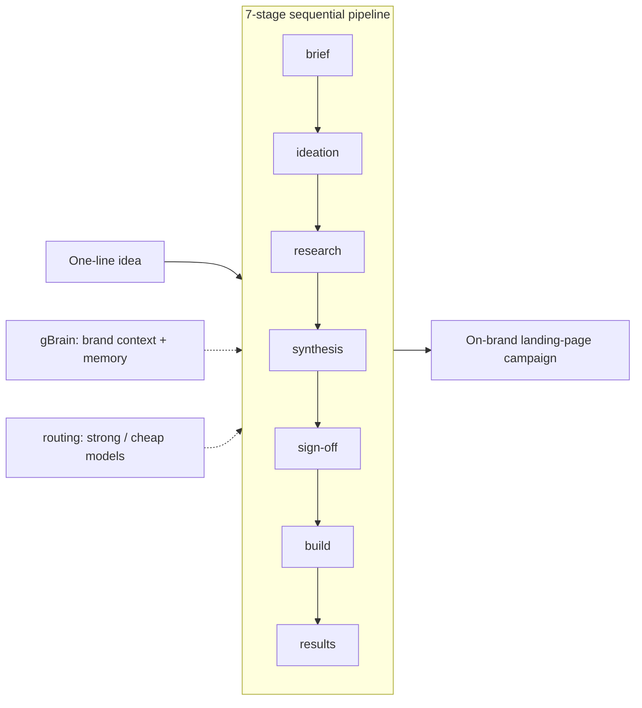

# Marketing Engine — documentation

The Marketing Engine turns one raw marketing idea into a shipped landing-page
campaign, end to end, on [Google's Agent Development Kit for Go][adk]
(`google.golang.org/adk/v2`, "adk-go").

**Figure: how one idea becomes one campaign — the linear pipeline, with gBrain
and model routing alongside.**

## Where to start

This directory is the product documentation set, split by audience and topic.

### Business

| You want to… | Read |
|---|---|
| Understand the product, who it's for, and what it produces | [Product guide](business/product.md) |
| Follow a run from idea to shipped campaign | [Campaign flow](business/campaign-flow.md) |
| Business guide landing page | [Business guide](business/README.md) |

### Technical

| You want to… | Read |
|---|---|
| Overview, quick start, and project layout | [Technical guide](technical/README.md) |
| The 7-stage pipeline, state-key contract, and the history-less invariant | [Architecture](technical/architecture.md) |
| The build stage: eval loop and the deliverable contract | [Build subsystem](technical/build-subsystem.md) |
| gBrain brand context and the memory feedback loop | [gBrain & memory](technical/gbrain-memory.md) |
| Model roles and configuration | [Model routing](technical/model-routing.md) |
| Testing approach and load-bearing ADK behaviors | [Testing](technical/testing.md) |
| Add a deliverable, swap a model, or insert a stage | [Extending the engine](technical/extending.md) |

## Source of truth

Code is the authority for *what* the engine does and *how*. These docs explain
*why* it is built this way, *where* to find each part, and the contracts that
make the pipeline swappable. When a doc and the code disagree, the code wins —
treat that as a doc bug.

- Runtime behavior: `cmd/engine/main.go`, `internal/`.
- Domain context (brand, offer, customer): `brand/`.
- Run + safety invariants for AI collaborators: `../CLAUDE.md`.

> `docs/superpowers/` holds the original design-time specs and implementation
> plans. They are historical design records, not the runtime authority; the
> guides here describe current behavior and supersede them where they differ.

[adk]: https://google.github.io/adk-docs/
