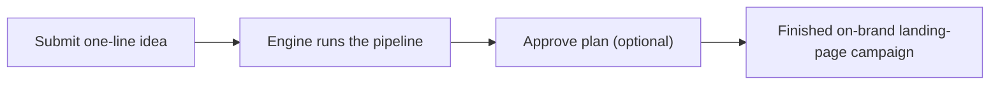

# Marketing Engine — business guide

The Marketing Engine is an automated campaign factory: you give it a one-line
marketing idea and it produces a finished, on-brand landing-page campaign you can
ship. It is also a learning project built on Google's Agent Development Kit for
Go (adk-go), structured as a pipeline of cooperating AI agents rather than a
single prompt.

**Figure: the promise — one idea in, one on-brand campaign out.**

## Where to go next

| You want to… | Read |
|---|---|
| Understand the product, who it's for, and what shapes the output | [Product guide](product.md) |
| Follow a run from idea to shipped campaign, stage by stage | [Campaign flow](campaign-flow.md) |

For the mechanics — how each piece is built, how to run it, and how to extend
it — see the [technical guide](../technical/README.md). For the top-level
documentation index, see the [docs home](../README.md).
