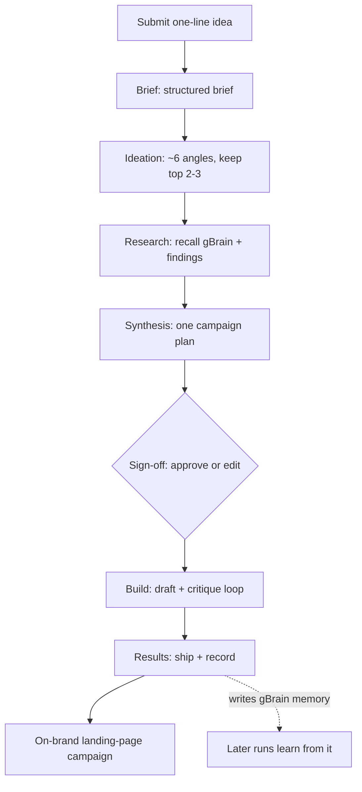

# Marketing Engine — campaign flow

## How the engine "thinks"

A run moves through seven stages, each a specialist agent handing work to the next
through a shared workspace:

1. **Brief** — turns your raw idea into a structured brief (product, goal,
   audience, tone, constraints).
2. **Ideation** — generates around six campaign angles, scores each against the
   brand and audience, and keeps the top few.
3. **Research** — recalls anything relevant the engine has learned before (its
   "gBrain") and assembles supporting findings.
4. **Synthesis** — merges the brief, the chosen angles, and the research into one
   concrete plan: hook, offer, message hierarchy, call-to-action.
5. **Sign-off** — pauses and shows you the plan. Approve it, or paste an edited
   version; the build uses what you signed off on.
6. **Build** — drafts the landing page, then critiques and re-drafts it until it
   passes a quality check (hero, offer, CTA, on-brand) or hits a limit.
7. **Results** — records the run back into gBrain memory, so later runs can learn
   from it. This is the feedback loop: every campaign makes the next one smarter.

**Figure: a single run from idea to shipped campaign. The dotted edge is the
feedback loop — what each run learns feeds the next one.**

## Current scope

The engine is a working end-to-end spine, intentionally focused:

- **One deliverable type today** — a landing page. The architecture is built so
  more types (social, email, blog, video) can be added without reworking the
  pipeline. See [extending the engine](../technical/extending.md).
- **One model, two roles** — a "strong" model for judgment calls (planning,
  quality checks) and a "cheap" model for drafting, both pointing at the same
  model for now. See [model routing](../technical/model-routing.md).
- **In-memory learning** — gBrain's accumulated memory lives in memory for this
  run; it is the seam for durable, cross-run memory later. See
  [gBrain & memory](../technical/gbrain-memory.md).
- **Human sign-off by default** — the engine pauses for your approval unless you
  enable unattended mode for CI or batch runs.

These are deliberate starting points: the whole pipeline exists and works, with
clear seams where each capability grows. For how each piece is built, see the
[technical guide](../technical/README.md).
