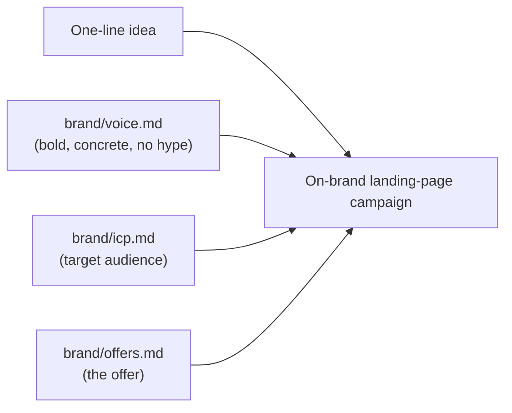

# Marketing Engine — product guide

## What it is

The Marketing Engine is an automated campaign factory. You give it a one-line
marketing idea — "a no-code analytics tool for indie hackers" — and it produces a
finished, on-brand landing-page campaign you can ship. It runs the full creative
process a marketer would: it briefs the idea, generates and scores campaign
angles, pulls relevant background, turns that into a concrete plan, asks you to
approve or edit it, builds the deliverable through a self-critique loop, and
records what happened so the next run is smarter.

It is also a learning project built on Google's Agent Development Kit for Go
(adk-go), structured as a pipeline of cooperating AI agents rather than a single
prompt.

## The problem

Indie hackers and small teams ship fast but market poorly. Writing a landing
page means juggling positioning, offer framing, calls-to-action, and brand voice
— work that is slow to do well and easy to skip. The engine automates the
draft-and-refine loop so a founder can go from idea to a usable campaign in one
run, with the brand's voice baked in.

## Who it's for

The engine's own campaign target — encoded in `brand/icp.md` — is **indie hackers
and small teams shipping side-projects who need product analytics without setup
overhead.** That same profile describes the engine's first user: a builder who
wants marketing artifacts without a marketing team.

## What you get from a run

Submit a one-line idea at the prompt. The engine returns a **landing-page
campaign** — a Markdown deliverable with a hero headline, an explicit offer, and
call-to-action variants, produced in the brand voice and checked for those
elements before it ships. Along the way it shows you a campaign plan and pauses
for your approval (or you can let it run unattended).

The reference product the campaigns sell — set in `brand/offers.md` — is a
**no-code analytics tool**: free tier, then $29/month.

## Brand voice

All copy the engine writes is shaped by `brand/voice.md`: **bold, concrete, no
hype. Short sentences. Talk to builders, not executives.** The engine reads this
voice at startup and injects it into every stage, so campaigns come out on-brand
by construction rather than by luck.

**Figure: the brand sources that shape every campaign. The idea is the input; the
`brand/*` files define the voice, audience, and offer that the output must match.**

## Current scope

The engine is a working end-to-end spine, intentionally focused. See the
[campaign flow](campaign-flow.md) for how a run moves and where each capability
grows.
