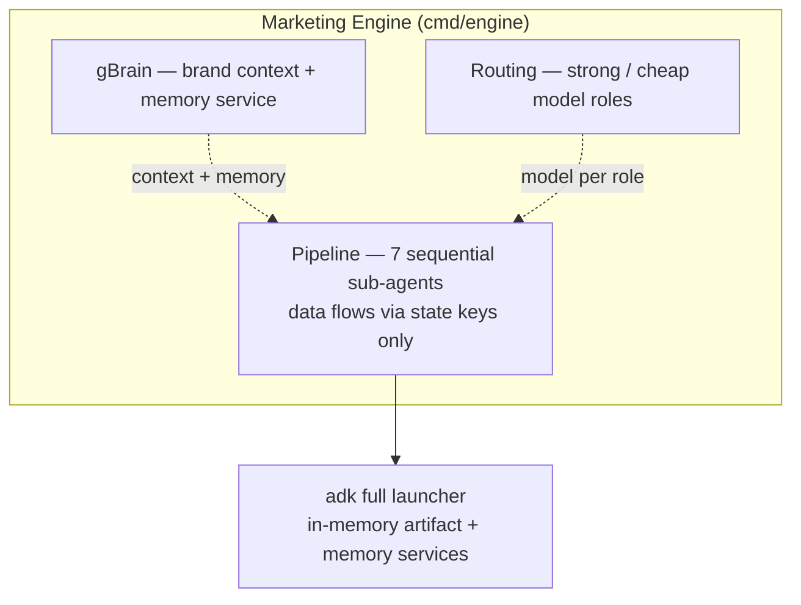

# Marketing Engine — technical guide

## Overview

The Marketing Engine is a Go CLI built on [adk-go][adk]
(`google.golang.org/adk/v2`). It assembles a pipeline of cooperating agents that
turn one raw idea into one landing-page Markdown artifact, passing data through
session **state keys**.

- **Module:** `github.com/captain-corgi/go-adk-example`
- **Go:** 1.26.5 · **adk-go:** v2.1.0 · **genai:** v1.63.0 · **godotenv**
- **Entry point:** `cmd/engine/main.go`

**Figure: component map — the pipeline and the subsystems that sit alongside it,
all handed to adk's launcher.**



## Quick start

```sh
go run ./cmd/engine
```

Configure an OpenAI-compatible model via a gitignored `.env` (copy
`.env.example`). Required for the default provider: `OPENAI_API_KEY`. The engine
also runs against any OpenAI Responses-API-compatible endpoint
(`OPENAI_BASE_URL`) such as Ollama, LM Studio, or vLLM.

Then submit a one-line idea at the prompt. The engine runs the full pipeline and
produces the landing-page campaign as an adk artifact, published in the run's
`build_output`. See [Model routing](model-routing.md#configuration) for every
knob.

## Reference

Each subsystem has its own page. Start with [Architecture](architecture.md) for
the spine and its invariants.

| Topic | Page |
|---|---|
| The 7-stage pipeline, state-key contract, history-less invariant, sign-off gate | [Architecture](architecture.md) |
| The build stage: eval loop, finalize, and the deliverable contract | [Build subsystem](build-subsystem.md) |
| gBrain brand context and the memory feedback loop | [gBrain & memory](gbrain-memory.md) |
| Model roles, the config fallback chain, and every env variable | [Model routing](model-routing.md) |
| Testing approach and the load-bearing ADK behaviors the code depends on | [Testing](testing.md) |
| Add a deliverable, swap a model, or insert a stage | [Extending the engine](extending.md) |

## Project layout

By responsibility (not an exhaustive file list):

| Package | Owns |
|---|---|
| `cmd/engine` | Process entry; wires the pipeline and launches it. |
| `internal/config` | Env loading; model construction; engine knobs. |
| `internal/routing` | Role→model registry. |
| `internal/keys` | The shared state-key constants. |
| `internal/brain` | gBrain: frozen brand context + memory service. |
| `internal/stages` (+ `brief`, `ideation`, `research`, `synthesis`, `signoff`, `results`) | The pipeline stage agents. |
| `internal/build/loop` | The drafter↔checker eval loop. |
| `internal/build/graph` | The build workflow graph + finalize. |
| `internal/build/deliverables` (+ `landingpage`) | The `Deliverable` contract and the landing-page implementation. |
| `internal/stagetest` | Test-only fakes and a runner harness. |
| `internal/contract` | The swappability contract test. |
| `internal/e2e` | End-to-end run test. |
| `brand/` | Frozen brand source (voice, offers, ICP). |

[adk]: https://google.github.io/adk-docs/
