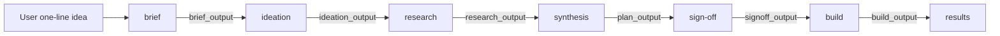
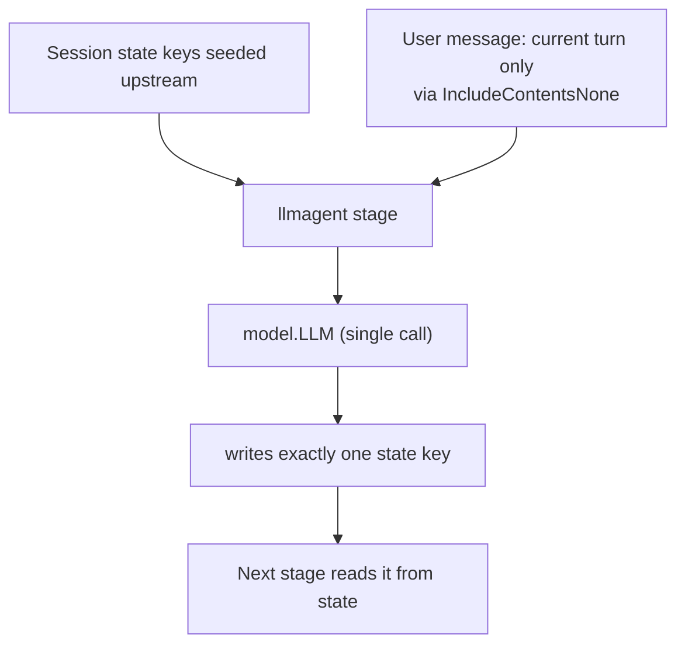
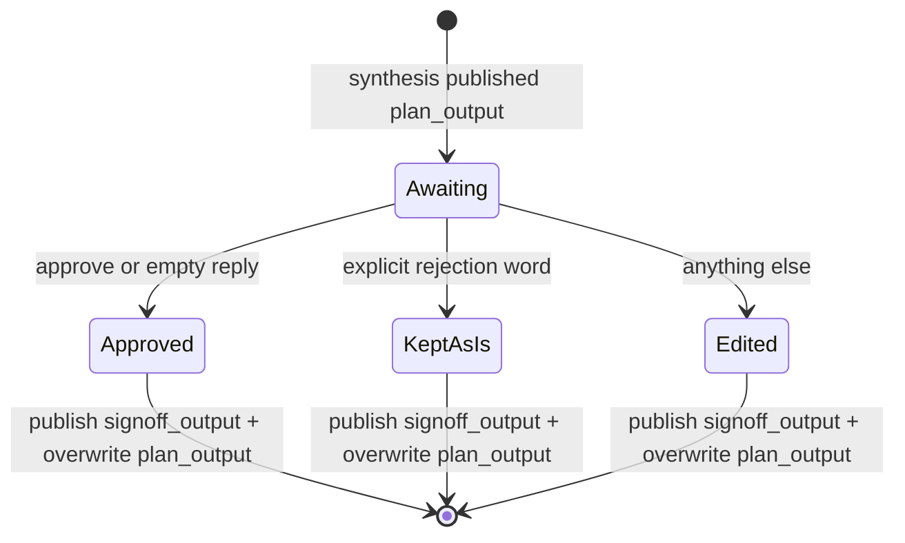

# Architecture

## The pipeline

The engine is one `sequentialagent` pipeline of seven sub-agents:

```
brief → ideation → research → synthesis → signoff → build → results
```

Each stage reads upstream outputs from session state and writes one typed JSON
blob to its own state key. Stages share no other coupling — that is what makes
the pipeline swappable. The first four stages (and the build loop's
drafter/checker) are `llmagent`s; signoff, build, and results are `workflowagent`s
built from function nodes.

**Figure: the pipeline, with the state key each stage writes as the edge to the
next. State keys are the only coupling between stages.**



> `sign-off` also **overwrites `plan_output`** with the approved plan, so the
> build stage always works from what was actually signed off.

### Pipeline stages

| Stage | Package | Reads (state) | Writes | Model role | What it does |
|---|---|---|---|---|---|
| brief | `internal/stages/brief` | user message | `brief_output` | cheap | Structures the raw idea into a brief JSON. |
| ideation | `internal/stages/ideation` | `brief_output` | `ideation_output` | cheap | Generates ~6 angles, scores, keeps top 2–3. |
| research | `internal/stages/research` | `brief_output` + memory | `research_output` | cheap | Recalls gBrain memory (via callback) + assembles findings. |
| synthesis | `internal/stages/synthesis` | brief + ideation + research | `plan_output` | strong | Merges everything into one campaign plan. |
| signoff | `internal/stages/signoff` | `plan_output` | `signoff_output` (+ overwrites `plan_output`) | — | Human approve/edit gate (HITL). |
| build | `internal/build/graph` | `plan_output`, loop state | `build_output` + artifact | both | Runs the eval loop; finalizes + saves artifact. |
| results | `internal/stages/results` | `build_output` | `results_output` | — | Writes gBrain memory; publishes run status. |

## State-key contract

Defined in `internal/keys/keys.go`. State keys are the **only** coupling between
stages.

| Key constant | Value | Owner |
|---|---|---|
| `Brief` | `brief_output` | brief |
| `Ideation` | `ideation_output` | ideation |
| `Research` | `research_output` | research |
| `Plan` | `plan_output` | synthesis (signoff overwrites it with the approved plan) |
| `Signoff` | `signoff_output` | signoff |
| `Build` | `build_output` | build |
| `Results` | `results_output` | results |
| `Draft` / `Critique` / `Verdict` | `landing_draft` / `landing_critique` / `landing_verdict` | the build eval loop |
| `MemCtx` | `memory_context` | research (via callback) |

Keys are underscored identifiers, not dotted, because adk's `{key}` instruction
templating only substitutes `^[a-zA-Z_][a-zA-Z0-9_]*$`. The contract test
`internal/contract/contract_test.go` guards this: each `llmagent` stage, fed its
input key, must publish its output key.

## The history-less invariant (load-bearing)

Every `llmagent` sets `IncludeContents: llmagent.IncludeContentsNone` and passes
data only through state keys. Two reasons:

1. **Correctness** — stages become stateless; each run is a function of its
   inputs, not prior chat history.
2. **The `openaimodel` multi-turn bug** — adk-go v2.1.0's `openaimodel`
   mis-encodes assistant turns on the second call, returning HTTP 400. Sending
   only the current turn sidesteps it.

`IncludeContentsNone` does **not** mean "send nothing": the runner still appends
the user's message as a user-authored event, so the first stage receives the raw
idea as `req.Contents[0]`. `internal/stagetest`'s `RecordingLLM` documents and
asserts this.

**Figure: the history-less data flow. A stage reads only the seeded state keys
and the current-turn user message, makes one model call, and writes one state
key. No prior chat history is sent.**



## Sign-off gate

`internal/stages/signoff` is a human-in-the-loop gate between synthesis and
build. With `AUTO_APPROVE=true` it copies the plan through. Otherwise it pauses
(`workflow.ResumeOrRequestInput`) and classifies your reply:

- **approve** (or empty) — keep the synthesis plan.
- an explicit **rejection** word — keep the plan (there is no abort path yet; a
  real reject/abort is future work).
- **anything else** — treated as an edited plan.

It publishes `signoff_output` **and** overwrites `plan_output` with the approved
version, so downstream stages build from what was actually signed off.

**Figure: sign-off reply classification. All three outcomes publish
`signoff_output` and overwrite `plan_output`.**


