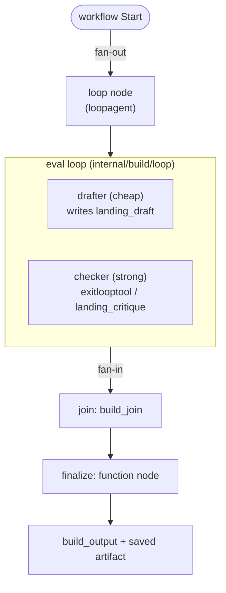

# Build subsystem

The build stage (`internal/build/graph`) is itself a `workflow` graph, not a
single agent:

```
Start ──fan-out──► [ eval loop ] ──fan-in──► join ──► finalize
```

The fan-out/fan-in exists even at one deliverable, so adding more deliverables
later is a matter of adding edges — not restructuring. See
[Extending the engine](extending.md).

**Figure: the build workflow graph. The loop node runs the drafter↔checker eval
loop; finalize validates, saves the artifact, and publishes `build_output`.**



## Eval loop

`internal/build/loop` is a `loopagent` over two agents:

- **drafter** (cheap) — writes `landing_draft`, improved from the prior critique.
- **checker** (strong) — reviews the draft; calls `exitlooptool` when it passes,
  otherwise writes `landing_critique` with fixes. An `AfterToolCallback`
  (`verdictOnExit`) stamps `landing_verdict = "pass"` when `exit_loop` fires.

The loop runs at most `MAX_LOOP_ITER` times (default 3). Convergence is
observable: `pass` means the checker approved it; otherwise the loop hit the cap.

**Figure: eval-loop convergence. The loop alternates drafting and checking until
the checker approves or the iteration cap is hit.**

```mermaid
stateDiagram-v2
    [*] --> Drafting
    Drafting --> Checking : drafter writes landing_draft
    Checking --> Passed : checker approves (exitlooptool; verdict = pass)
    Checking --> Critiqued : needs fixes (writes landing_critique)
    Critiqued --> Drafting : next iteration
    Passed --> [*]
    Drafting --> [*] : hit MAX_LOOP_ITER
```



## finalize

`finalize` (a function node in `internal/build/graph`) reads the settled draft,
plan, and verdict; calls the deliverable's `Build` to validate; saves the artifact
via `ctx.Artifacts().Save`; and publishes `build_output` with a `quality` of
`approved` (checker passed) or `max_iter_reached` (hit the cap). If validation
fails on a non-converged draft, it still ships the best draft and logs it.

`finalize` returns a `*session.Event` directly. Why: a `FunctionNode` does **not**
propagate `ctx.State().Set` into its emitted event — it special-cases a returned
`*session.Event` and yields its `StateDelta` intact. This is one of the
[load-bearing ADK behaviors](testing.md#key-adk-behaviors-this-relies-on) the code
depends on.

## Deliverable contract

`internal/build/deliverables` defines the seam every output type implements:

```go
type Deliverable interface {
    Name() string
    Build(ctx context.Context, in BuildInput) (*Artifact, error)
}
```

`BuildInput` carries the upstream JSON outputs (`Brief`, `Plan`, `Research`,
`Brand`) plus the settled `Draft`. `Build` is deterministic — it makes no model
calls; the draft already came from the loop. One implementation exists:
`landingpage` (`Name() = "landing_page"`), whose `Build` validates the draft has
a hero, an offer, and a CTA. It also satisfies the loop's `LoopSpec`
(drafter/checker instructions + draft/critique keys).
