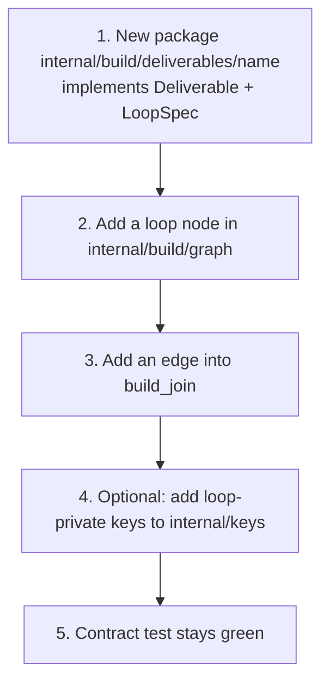

# Extending the engine

The pipeline is built to grow at its seams. The contract test
(`internal/contract`) fails loudly if a key contract breaks.

## Add a deliverable type (e.g. social posts)

**Figure: the canonical growth path. A new deliverable is a package plus a few
wiring edges into the existing build graph.**

1. Add a package under `internal/build/deliverables/<name>` implementing
   `Deliverable` (`Name`, deterministic `Build`) and `loop.LoopSpec` (drafter/
   checker instructions, draft/critique keys).
2. Wire it into the build graph in `internal/build/graph` — add a loop node and
   edges into the existing `join`.
3. Add its keys to `internal/keys` if it needs loop-private state.

## Add or swap a model role

Add a role in `internal/routing` and a model in `internal/config`; point a stage
at it. Stages already take a `model.LLM`, so an in-role swap needs no stage
changes. See [Model routing](model-routing.md).

## Reorder or insert a stage

Honor the upstream output key and produce your own; update the `SubAgents` list
in `cmd/engine/main.go`. The contract test will fail loudly if a key contract
breaks. See [Architecture](architecture.md).
