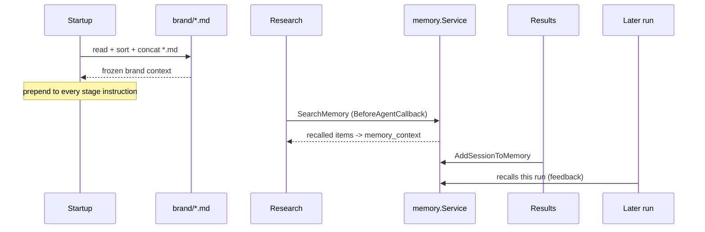
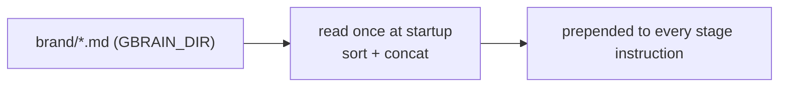

# gBrain & memory

`internal/brain` is the engine's memory, in two layers:

- **Frozen brand context** — all `*.md` under `GBRAIN_DIR` (default `./brand`),
  read once at startup, sorted, concatenated, and prepended to every stage's
  instruction. A missing directory is non-fatal (empty brand context).
- **Accumulated memory** — an in-memory `memory.Service`. The research stage
  queries it (`SearchMemory`) through a `BeforeAgentCallback` that writes the
  result to `memory_context`; the results stage writes back
  (`AddSessionToMemory`). This is the feedback loop.

**Figure: one run's memory lifecycle. Brand context is frozen at startup;
accumulated memory is read at research and written at results, so later runs
recall it.**

## Why a callback, not a tool

Memory is read via a callback, not a model-called tool, deliberately: a tool
round-trip would re-send an assistant turn and trigger the `openaimodel`
multi-turn bug described in [Architecture](architecture.md#the-history-less-invariant-load-bearing).
Memory failures are best-effort — a transient `SearchMemory` error degrades to
empty context rather than aborting research.

**Figure: brand-context injection. The brand files are read once and prepended to
every stage's instruction, so every stage sees the same frozen context.**

