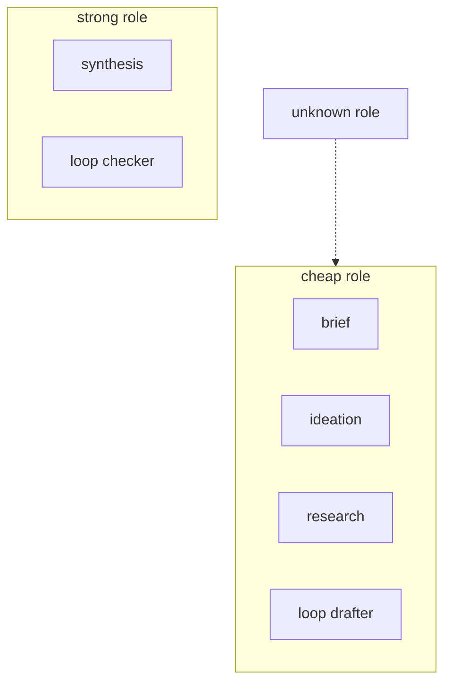
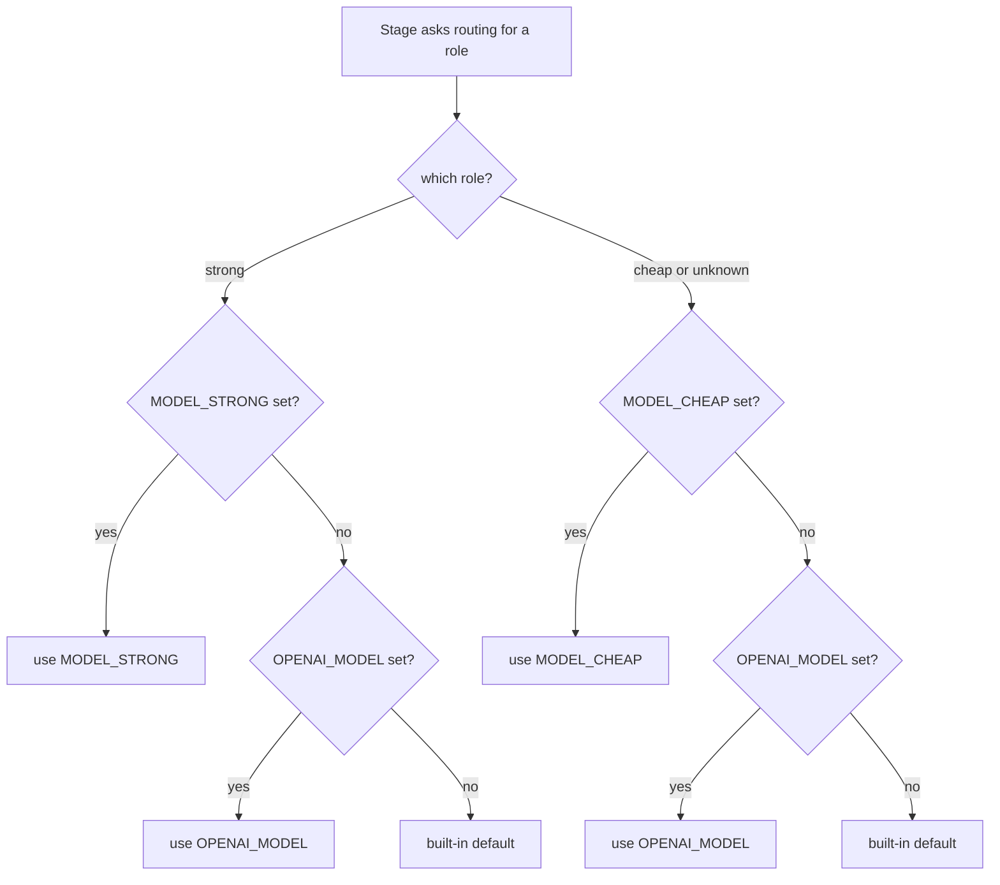

# Model routing

`internal/routing` maps a role to a `model.LLM`:

- `strong` — judgment: synthesis, the loop's checker.
- `cheap` — drafting: brief, ideation, research, the loop's drafter.
- Unknown roles fall back to `cheap`.

Both roles are built in `internal/config` from `MODEL_STRONG` / `MODEL_CHEAP`,
each falling back to `OPENAI_MODEL`, then the built-in default. Today both point
at the same model; the seam exists so routing can split them without touching
stages.

**Figure: role → stages. `strong` serves judgment stages; `cheap` serves drafting
stages; an unknown role falls back to `cheap`.**

## Configuration

All via environment (load a gitignored `.env`; see `.env.example`). Secrets are
never hardcoded.

**Figure: model resolution per role. Each role checks its own env var first, then
falls back to `OPENAI_MODEL`, then the built-in default.**

| Variable | Default | Purpose |
|---|---|---|
| `OPENAI_API_KEY` | — | API key (blank if your endpoint doesn't need one). |
| `OPENAI_BASE_URL` | api.openai.com | Any OpenAI Responses-API-compatible server. |
| `OPENAI_MODEL` | `gpt-5.6-sol` | Model name; fallback for the two roles below. |
| `MODEL_STRONG` | = `OPENAI_MODEL` | Model for judgment stages. |
| `MODEL_CHEAP` | = `OPENAI_MODEL` | Model for drafting stages. |
| `AUTO_APPROVE` | `false` | Bypass the sign-off gate (CI / batch). |
| `MAX_LOOP_ITER` | `3` | Max drafter→checker iterations per deliverable. |
| `GBRAIN_DIR` | `./brand` | Directory of frozen brand Markdown files. |
