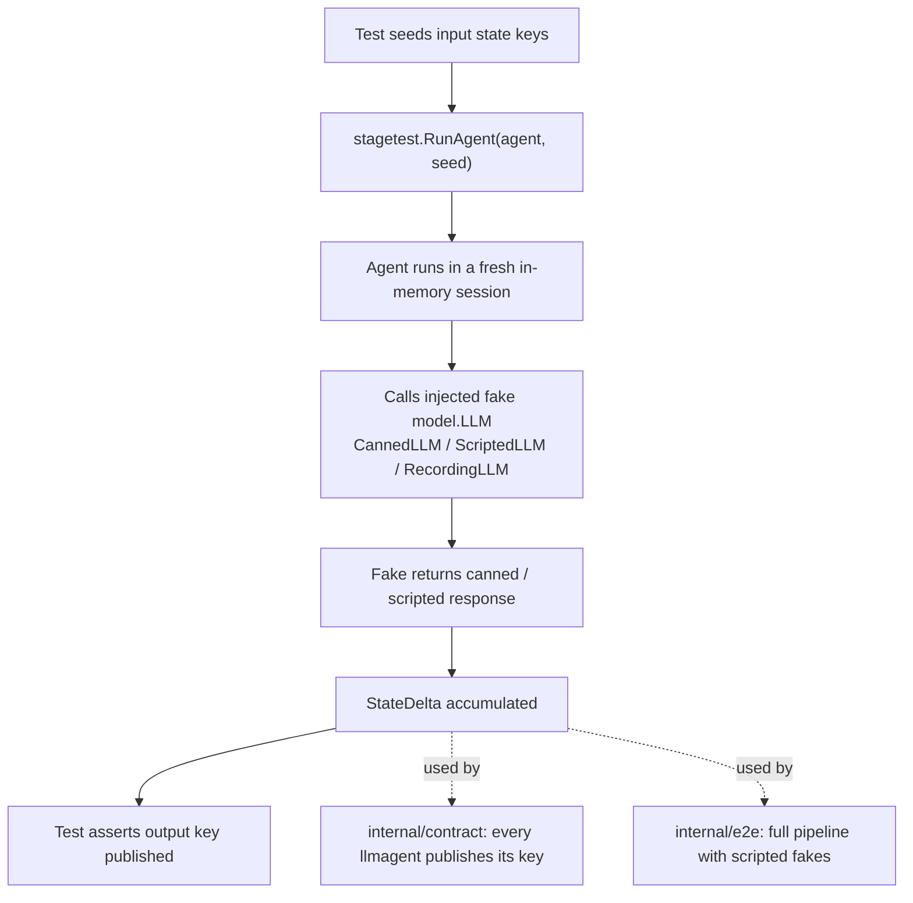

# Testing

## Approach

- **No API key needed.** Every test injects hand-rolled fake `model.LLM`s
  (`stagetest.CannedLLM` / `ScriptedLLM` / `RecordingLLM`).
- `stagetest.RunAgent` runs one agent in a fresh in-memory session, seeded with
  state, and returns the accumulated `StateDelta`.
- `internal/contract` proves each `llmagent` stage publishes its key.
- `internal/e2e` exercises the full pipeline.

```sh
go test ./...
```

**Figure: the stagetest harness. A test seeds input state, runs one agent against
an injected fake model, and asserts on the accumulated `StateDelta`. The contract
and e2e suites build on the same harness.**



## Key ADK behaviors this relies on

These are non-obvious adk-go v2.1.0 behaviors the code depends on; they're
documented here because they are decisions, not accidents:

- `IncludeContentsNone` means "current turn only," not "send nothing" — the
  runner still appends the user's message. Used to keep stages history-less and
  to avoid the multi-turn bug (see
  [Architecture](architecture.md#the-history-less-invariant-load-bearing)).
- A `FunctionNode` does **not** propagate `ctx.State().Set` into its event; it
  special-cases a returned `*session.Event` and yields its `StateDelta` intact.
  `finalize` and `results` return events directly for this reason (see
  [Build subsystem](build-subsystem.md#finalize)).
- An `EmittingFunctionNode` discards `ctx.actions.StateDelta`, so `signoff`
  emits its `StateDelta` event explicitly.
