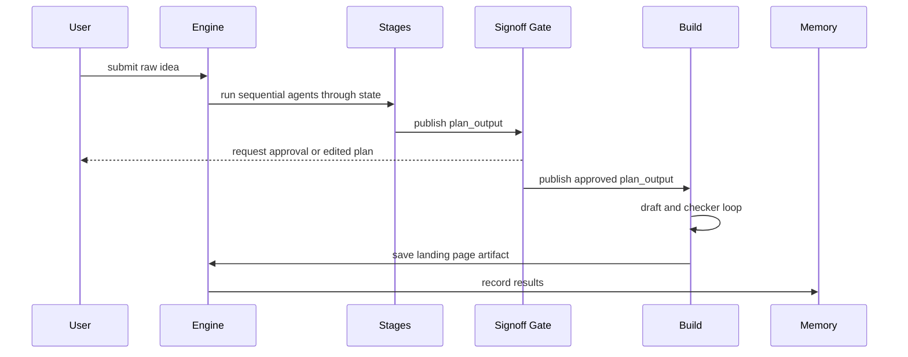

# Architecture overview

The executable assembles one ADK `sequentialagent` named `marketing_engine`. Its sub-agents run in this order: brief, ideation, research, synthesis, signoff, build, and results. `cmd/engine/main.go` is the composition root; packages under `internal/` own behavior rather than process wiring.

## Boundaries and data flow

The sequence is grounded in the launcher composition and stage implementations; stages communicate through session state, not direct calls to one another.

### State-key contract

[`internal/keys/keys.go`](../../internal/keys/keys.go) defines the only intended stage coupling. The principal keys are `brief_output`, `ideation_output`, `research_output`, `plan_output`, `signoff_output`, `build_output`, and `results_output`; the build loop additionally uses `landing_draft`, `landing_critique`, and `landing_verdict`. Research uses `memory_context` for callback-provided context.

Keys are underscore identifiers because ADK instruction templating accepts that identifier shape. `internal/contract/contract_test.go` protects the publish contract for LLM stages.

## Important invariants

- LLM stages use `IncludeContentsNone` and pass data through state. This makes runs history-less and avoids the ADK `openaimodel` multi-turn encoding issue documented in `docs/technical/README.md`.
- The sign-off stage emits its state delta explicitly because an `EmittingFunctionNode` does not propagate `ctx.State().Set` into the emitted event.
- Build finalization returns a `*session.Event` so `build_output` and loop-state resets survive ADK's function-node event handling.
- `strong` and `cheap` are roles, not hard-coded stage dependencies. Configuration constructs both from `MODEL_STRONG` and `MODEL_CHEAP`, falling back to `OPENAI_MODEL`.

## Cross-cutting services

[`internal/brain`](../../internal/brain/brain.go) loads sorted Markdown brand context from `GBRAIN_DIR` at startup and wraps the memory service. Research queries memory through a callback; results writes the completed run back. [`internal/routing`](../../internal/routing/routing.go) is the role-to-model registry. The launcher currently supplies ADK in-memory artifact and memory services, so persistence is not yet a deployment concern.

For behavior by stage, follow [Pipeline workflows](../workflows/pipeline.md). For package ownership, use the [Source map](../source-map.md). The external model boundary and repository automation are summarized in [Integrations](../integrations/model-and-ci.md).
