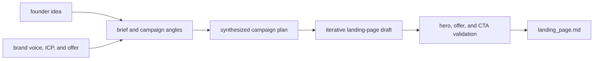

# Marketing engine domain

The product promise is simple: a founder supplies one idea and receives a usable, on-brand landing-page campaign without a dedicated marketing team. The reference audience in `brand/icp.md` is indie hackers and small teams shipping side projects who need product analytics without setup overhead. The reference offer in `brand/offers.md` is a no-code analytics tool with a free tier and a $29/month plan.

## Brand as an input, not a post-processing step

`brand/voice.md` defines bold, concrete, no-hype writing with short sentences aimed at builders rather than executives. `internal/brain` reads all Markdown under `GBRAIN_DIR`, sorts and concatenates it, and prepends the context to each stage instruction. This means voice, ICP, and offer shape briefing through final copy by construction.

The domain's run lifecycle is explained in [Pipeline workflows](../workflows/pipeline.md), while the context-loading mechanism belongs to the [Architecture overview](../architecture/overview.md).

## Campaign output

The current deliverable is `landing_page.md`. It must contain a hero, an offer, and a call to action; the landing-page builder validates these elements before saving. The build loop also evaluates whether the draft is sufficiently on-brand, but the deterministic deliverable validation is the hard structural check.

The diagram shows how brand context is an input to campaign shaping, while deterministic validation is the final structural gate.

The `Deliverable` interface is the extension point for future social, email, blog, or video outputs. New verticals should keep their model-driven drafting in a loop and their final `Build` deterministic, then wire a loop node into the existing build graph.

## Product limits that matter

- Only a landing-page vertical is implemented today.
- Memory is accumulated through an in-memory ADK service, so “learning” does not survive process restart.
- Human sign-off is the default product control; unattended mode is explicit.
- A rejection currently does not abort a campaign. It preserves the plan, an intentional Phase 0 limitation.

These limitations are operationally relevant; see [Operations runbook](../operations/runbook.md). Tests that protect the domain contract are listed in [Testing guidance](../testing/testing.md). The model-provider boundary supporting copy generation is described in [Integrations](../integrations/model-and-ci.md).
