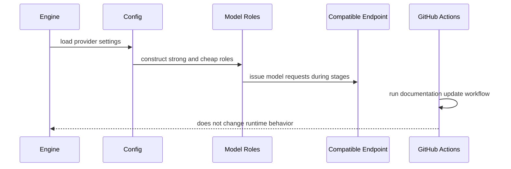

# Integrations

The application has one runtime provider boundary: `internal/config` constructs ADK models that speak to an OpenAI Responses-API-compatible endpoint. Repository automation is separate from the engine runtime and is defined under `.github/workflows`.

The diagram separates the runtime model boundary from repository documentation automation.

## Model endpoint

`internal/config/config.go` reads `OPENAI_API_KEY`, `OPENAI_BASE_URL`, and model names from the environment, then builds the `strong` and `cheap` roles consumed by the [engine architecture](../architecture/overview.md). `OPENAI_BASE_URL` can point at a compatible hosted or local server; compatibility with the expected Responses API is the practical requirement.

`MODEL_STRONG` and `MODEL_CHEAP` let operators separate judgment from drafting workloads. Each falls back to `OPENAI_MODEL`, and the built-in default is `gpt-5.6-sol`. The [operations runbook](../operations/runbook.md) is the canonical place for variable defaults and safe local setup. Do not place credentials in source or documentation.

The model boundary is deliberately injected into stages rather than called directly from business code. This supports the offline fake-model strategy in [testing guidance](../testing/testing.md) and keeps routing changes in `internal/routing` and `internal/config`.

## Repository automation

- `.github/workflows/openwiki-update.yml` runs `openwiki code --update --print` on its configured daily schedule or by manual dispatch. It installs the pinned OpenWiki, Mermaid, and jsdom packages, supplies the OpenRouter and optional LangSmith environment variables from GitHub secrets, and opens or updates an `openwiki/update` pull request containing the generated `openwiki/` content plus selected agent/workflow files. It is documentation automation, not part of the Marketing Engine pipeline.
- `.github/workflows/claude-review.yml` provides pull-request review automation. It does not supply runtime model configuration to `cmd/engine`.
- `go.mod` defines the application dependencies, including `google.golang.org/adk/v2`, `google.golang.org/genai`, and `godotenv`.

The OpenWiki workflow is itself secured by GitHub Actions secret injection: the repository stores no provider values in the workflow, only references such as `OPENROUTER_API_KEY`, `OPENWIKI_LANGSMITH_API_KEY`, and optional LangSmith tracing settings. Review the generated pull request before merging because the workflow has write and pull-request permissions.

There is no shipped application connector for a CRM, analytics platform, durable database, or artifact store. The launcher uses in-memory ADK services, so [operations](../operations/runbook.md) should be consulted before treating a run as persistent.

## Integration change checklist

1. Confirm the provider implements the model API shape expected by ADK and the configured endpoint.
2. Update `.env.example` and `internal/config` for new non-secret knobs; never commit `.env` or live credentials.
3. Preserve the `strong`/`cheap` role contract in [architecture](../architecture/overview.md).
4. Add fake-backed tests first, then document any provider-only behavior or missing CI coverage.
