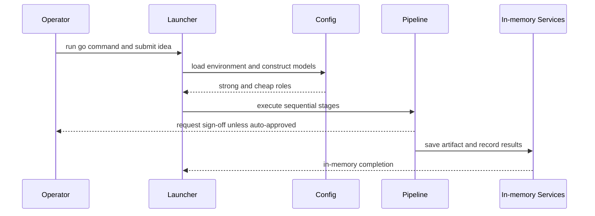

# Operations runbook

## Configuration

Configuration is loaded by `internal/config/config.go` from an optional `.env` plus the process environment. Copy `.env.example`; keep the resulting `.env` gitignored.

| Variable | Default | Meaning |
|---|---|---|
| `OPENAI_API_KEY` | empty | Credential for the OpenAI-compatible model endpoint. |
| `OPENAI_BASE_URL` | provider default | OpenAI Responses-API-compatible endpoint. |
| `OPENAI_MODEL` | `gpt-5.6-sol` | Fallback model name. |
| `MODEL_STRONG` | `OPENAI_MODEL` | Judgment model for synthesis and checking. |
| `MODEL_CHEAP` | `OPENAI_MODEL` | Drafting model for brief, ideation, research, and drafting. |
| `AUTO_APPROVE` | `false` | Skip interactive sign-off when `true` or `1`. |
| `MAX_LOOP_ITER` | `3` | Maximum drafter/checker iterations. Invalid integers fall back to the default. |
| `GBRAIN_DIR` | `./brand` | Directory containing frozen brand Markdown. |

The model endpoint can be a local OpenAI-compatible server when its API shape is supported. A missing `.env` is non-fatal; malformed configuration and model-construction errors are returned by `config.Load` and fail the entrypoint with a labeled error.

## Normal run

```sh
go run ./cmd/engine
```

Submit a one-line idea. Interactive runs pause at sign-off. For CI or batch execution, set `AUTO_APPROVE=true`; the repository's E2E test follows this path with fake models rather than a live API.



This operational flow highlights that artifacts and memory are process-local in the current Phase 0 implementation.

## Artifacts and memory

`cmd/engine/main.go` supplies ADK's in-memory artifact and memory services. The build stage saves the landing-page content through `ctx.Artifacts().Save`; results writes the run into memory for later research during the same process. There is no durable storage or restart recovery in this phase.

## Troubleshooting checkpoints

- **Startup fails at config:** verify model names and endpoint configuration without exposing API keys; construction errors are intentionally returned rather than hidden in a constructor log fatal.
- **The run stops for input:** this is expected unless `AUTO_APPROVE` is enabled. Use `approve` or paste the edited plan.
- **A rejection behaves like approval:** this is current Phase 0 behavior by design; explicit rejection words preserve the existing plan because no abort path exists.
- **Build quality is `max_iter_reached`:** the checker did not call `exit_loop` before `MAX_LOOP_ITER`. The best draft is still attempted and may still be shipped.
- **A later run appears influenced by an earlier draft:** inspect build finalization and preserve resets for `landing_draft`, `landing_critique`, and `landing_verdict`.

Use [Testing guidance](../testing/testing.md) before changing these behaviors. The architecture rationale for state and ADK event handling is in [Architecture overview](../architecture/overview.md). Provider and automation boundaries are documented in [Integrations](../integrations/model-and-ci.md).
