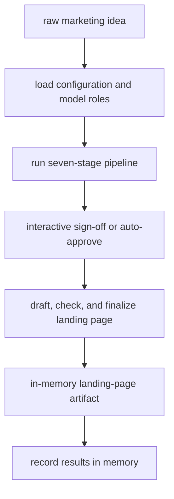

# Marketing Engine

The Marketing Engine is a Go CLI built on Google's Agent Development Kit for Go. It accepts one raw marketing idea and runs a seven-stage pipeline that produces a landing-page Markdown campaign. The current repository is a Phase 0 end-to-end spine: one landing-page deliverable, in-memory memory and artifacts, configurable model routing, and human sign-off by default.



This overview shows the shipped Phase 0 path; detailed stage behavior is in [Pipeline workflows](workflows/pipeline.md).

## Run it

1. Copy `.env.example` to a gitignored `.env` and configure the OpenAI-compatible endpoint. Never commit credentials.
2. Run:

```sh
go run ./cmd/engine
```

3. Submit a one-line idea. The default interactive path pauses at sign-off; reply `approve` or paste an edited plan. Set `AUTO_APPROVE=true` for unattended execution. The launcher saves the landing-page artifact in its in-memory artifact service and prints its location.

Run the test suite without a live API:

```sh
go test ./...
```

## How to navigate this wiki

- [Architecture overview](architecture/overview.md) explains composition, state keys, ADK invariants, gBrain, and model roles. It is the best starting point for cross-cutting changes.
- [Pipeline workflows](workflows/pipeline.md) explains each stage, human sign-off classification, and the build eval loop.
- [Marketing domain](domain/marketing-engine.md) records the product promise, audience, brand inputs, landing-page contract, and current scope.
- [Operations runbook](operations/runbook.md) covers environment variables, local execution, artifacts, memory, and troubleshooting.
- [Testing guidance](testing/testing.md) explains fake models, contract tests, workflow tests, and the E2E smoke test.
- [Source map](source-map.md) maps packages to ownership and gives extension routes.
- [Integrations](integrations/model-and-ci.md) explains the model endpoint boundary and repository automation, without treating CI tooling as runtime behavior.

## Where changes usually start

- Change pipeline order or stage contracts: `cmd/engine/main.go`, `internal/keys`, and `internal/stages`.
- Change output types: `internal/build/deliverables` and `internal/build/graph`.
- Change model selection or runtime knobs: `internal/config` and `internal/routing`.
- Change brand behavior or learning: `brand/` and `internal/brain`.
- Change approval semantics: `internal/stages/signoff`; recent history specifically hardened rejection words to preserve the plan rather than accidentally treating `no` as an edited plan.

Existing source documentation remains useful: `docs/technical/README.md` is the detailed implementation guide and `docs/business/README.md` is the product narrative. This wiki condenses those guides with current source and recent git reasoning.

## Recent repository direction

The commit sequence shows deliberate growth from configuration and state-key seams, through stages and gBrain, to the build loop, graph, sign-off, and E2E coverage. The latest fixes focus on safe sign-off classification, config error propagation, stale-state resets, and reliable idea delivery. Treat those behaviors as load-bearing when extending the Phase 0 spine.

## Backlog

- **Phase 1 swappable build and later verticals** — anchors: `docs/superpowers/specs/2026-08-02-phase1-swappable-build-design.md` through `phase5-routing-polish-design.md`; deferred because the working implementation still exposes only the Phase 0 landing-page vertical and the designs describe planned evolution rather than shipped behavior.
- **Durable memory and artifact persistence** — anchors: `internal/brain` and `cmd/engine/main.go`; deferred because the current launcher uses ADK in-memory services and no persistence adapter is implemented.
- **Additional deliverable verticals** — anchors: `internal/build/deliverables` and the Phase 1–4 specs; deferred because only `landingpage` is wired into the current build graph.
- **Production observability and provider validation** — anchors: `.github/workflows`, `internal/config`, and `go.mod`; deferred because repository automation exists, but no application metrics, tracing, retry policy, or live-provider CI is documented as shipped behavior.
