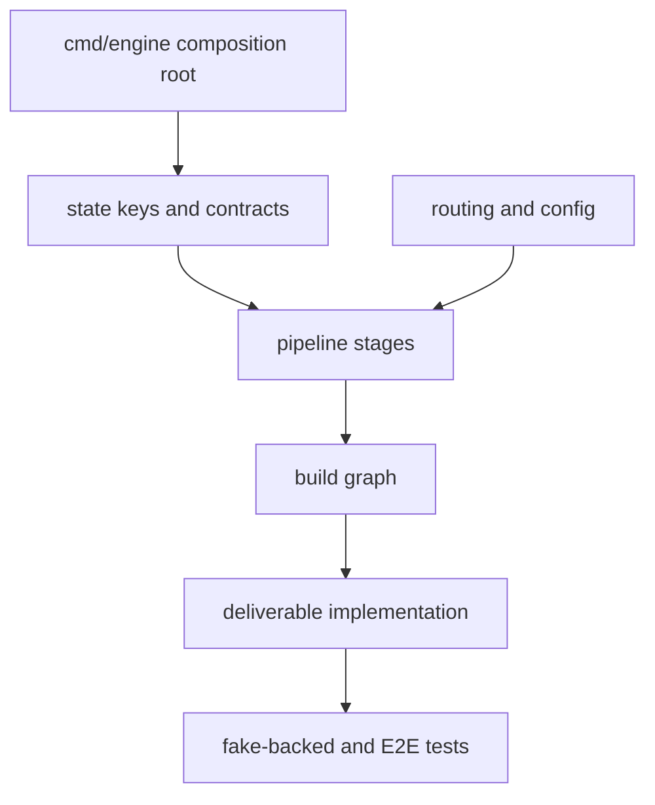

# Source map

Start at `cmd/engine/main.go` for composition and at `docs/technical/README.md` for the existing detailed technical guide. The map below groups code by responsibility rather than listing every file.

| Area | Location | Owns |
|---|---|---|
| Process entry | `cmd/engine` | Configures ADK services, stages, sequential pipeline, and launcher. |
| Configuration | `internal/config` | `.env` loading, OpenAI-compatible model construction, runtime knobs. |
| Routing | `internal/routing` | `strong`/`cheap` role registry and fallback behavior. |
| State contract | `internal/keys`, `internal/contract` | Shared state names and contract verification. |
| Brand and memory | `internal/brain`, `brand/` | Frozen Markdown context, memory callbacks, ICP, offer, and voice. |
| Pipeline stages | `internal/stages` and its stage directories | Brief, ideation, research, synthesis, sign-off, and results. |
| Build loop | `internal/build/loop` | Drafter/checker iteration and verdict callback. |
| Build graph | `internal/build/graph` | Loop graph, join, finalization, artifact save, and reset behavior. |
| Deliverables | `internal/build/deliverables` and `landingpage` | Deterministic output contract and current landing-page implementation. |
| Test infrastructure | `internal/stagetest`, `internal/e2e` | Fake LLMs, isolated execution, and full-pipeline smoke test. |
| Documentation | `docs/README.md`, `docs/business`, `docs/technical` | Human-oriented business and technical guides; this wiki is the navigable synthesis layer. |

## Extension routes

- Add a deliverable under `internal/build/deliverables/<name>`, implement `Deliverable` and loop instructions, then add its loop node and join edge in `internal/build/graph`.
- Add a model role in `internal/routing` and construct/configure it in `internal/config`; stages already receive model dependencies.
- Insert or reorder a stage by honoring the upstream state key, publishing a new key, and updating `SubAgents` in `cmd/engine/main.go`.
- Expand gBrain by changing the `internal/brain` seam rather than teaching individual stages how to persist memory.

This extension map shows the main ownership path: composition and contracts constrain stage changes, while build additions must remain covered by the test infrastructure.

The architectural consequences of these routes are covered in [Architecture overview](architecture/overview.md), while workflow-specific details are in [Pipeline workflows](workflows/pipeline.md). Runtime provider boundaries are in [Integrations](integrations/model-and-ci.md).
