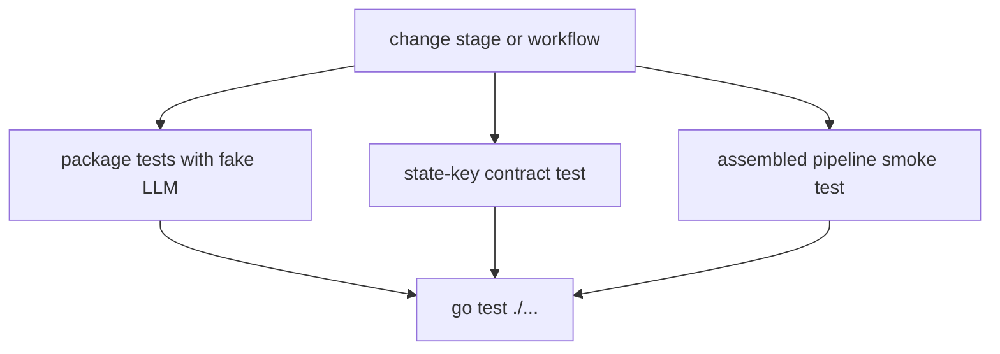

# Testing guidance

The suite avoids live model calls and API credentials. Test-only implementations in `internal/stagetest` include canned, scripted, and recording LLMs; `RunAgent` creates a fresh in-memory session, seeds state, executes one agent, and returns the resulting state delta.

## Test layers

- Package tests alongside each stage protect prompt wiring, output shape, and local behavior.
- `internal/contract/contract_test.go` verifies the state-key contract: an LLM stage given its input publishes its declared output. This protects the swappable pipeline boundary.
- `internal/build/loop` and `internal/build/graph` tests cover loop verdicts, graph execution, finalization, artifact saving, and state resets.
- `internal/e2e/e2e_test.go` runs the assembled pipeline with fake models and `AUTO_APPROVE`-style behavior, checking that a landing-page artifact is produced.



This is the repository's validation path, not a claim that tests call external services.

## Commands and change guidance

Run the full suite:

```sh
go test ./...
```

When adding a stage, add focused tests and update the contract test inputs/outputs. When changing state keys, update `internal/keys/keys.go`, all instruction templates and consumers, then run contract and E2E tests. When changing sign-off, test approval, empty input, rejection words, and edited-plan input separately. When changing the build graph, test both convergence and the max-iteration path, plus artifact and stale-state behavior.

The [Operations runbook](../operations/runbook.md) describes the runtime controls these tests intentionally replace. The [Source map](../source-map.md) points to the relevant packages, and [Integrations](../integrations/model-and-ci.md) explains why provider tests remain separate from the offline suite.
