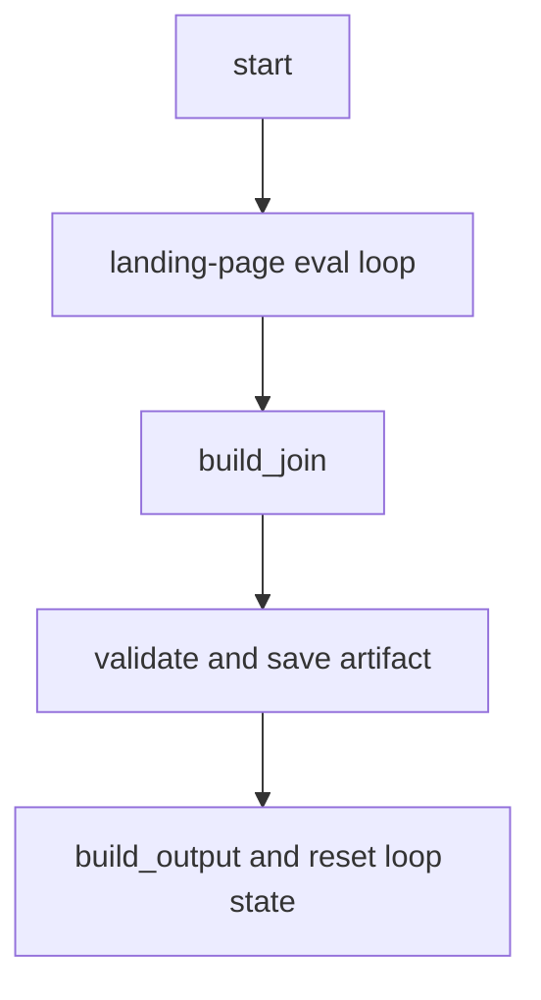

# Pipeline workflows

A run is a sequential handoff of typed JSON state. The first four stages are LLM agents; sign-off, build, and results are workflow/function nodes. The stage interface and constructors live under `internal/stages`; the assembled order is in `cmd/engine/main.go`.

## Stage responsibilities

| Stage | Reads | Publishes | Purpose |
|---|---|---|---|
| Brief | user message | `brief_output` | Structure the raw idea into product, audience, goal, tone, and constraints. |
| Ideation | brief | `ideation_output` | Generate and score campaign angles, retaining the strongest few. |
| Research | brief and memory callback | `research_output` | Assemble findings and relevant prior run context. |
| Synthesis | brief, ideation, research | `plan_output` | Produce the campaign hook, offer, message hierarchy, and CTA. |
| Sign-off | plan | `signoff_output`, overwrites `plan_output` | Pause for approval or accept an edited plan. |
| Build | approved plan and loop state | `build_output`, artifact | Iterate the landing page and save it. |
| Results | build output | `results_output` | Record run results in memory. |

## Sign-off behavior

By default, `internal/stages/signoff/signoff.go` uses `workflow.ResumeOrRequestInput`. An empty reply or `approve` keeps the synthesis plan. An explicit rejection token such as `no`, `reject`, `cancel`, or `abort` also keeps the plan because Phase 0 has no abort path. Any other reply is treated as an edited plan. In every case the approved value is emitted to both `signoff_output` and `plan_output`, ensuring build consumes what was actually signed off.

`AUTO_APPROVE=true` bypasses the pause and copies the plan. This is the mode used by unattended runs and the E2E smoke test.

## Build workflow

The build stage is a workflow graph rather than one agent:

The graph is intentionally fan-out/fan-in shaped even though Phase 0 has one deliverable. The loop's cheap drafter writes `landing_draft`; the strong checker either exits with `landing_verdict=pass` or writes `landing_critique` for another iteration. `MAX_LOOP_ITER` defaults to 3. Finalization labels quality `approved` on pass and `max_iter_reached` otherwise.

`internal/build/deliverables.Deliverable` makes final construction deterministic: model calls happen in the loop, while `Build` validates and renders from the settled draft. The current landing-page implementation checks for a hero, offer, and CTA. If a non-converged draft fails validation, finalization logs the failure and still ships the best draft.

Recent history explains two safety details: the build graph was introduced with the loop/join/finalize seam, and the current working-tree graph change resets draft and critique in addition to verdict so a later run cannot inherit stale loop state. Finalization therefore clears `landing_verdict`, `landing_critique`, and `landing_draft` after publishing `build_output`; a new run cannot be steered by a previous critique or silently reuse a previous draft if its drafter produces no value.

For configuration and failure handling, see [Operations runbook](../operations/runbook.md). For domain meaning, see [Marketing domain](../domain/marketing-engine.md). For the model boundary used by LLM stages, see [Integrations](../integrations/model-and-ci.md).
